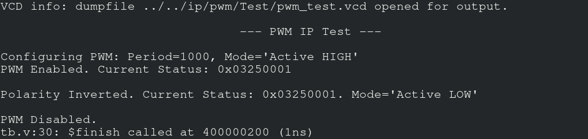
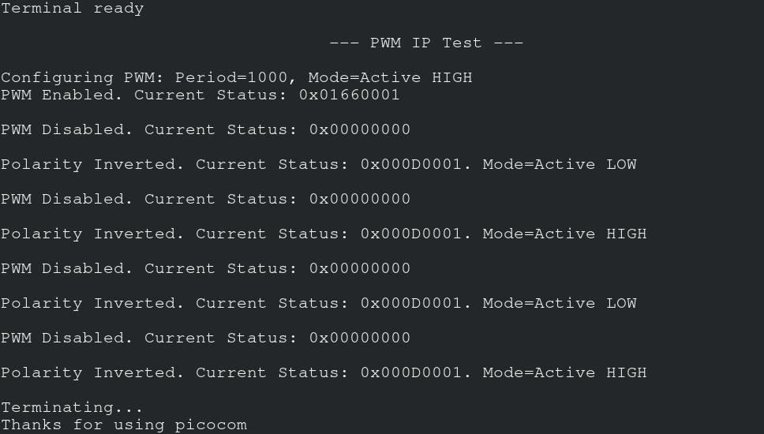

# VSDSquadron FPGA Mini Internship - Task 3 Submission

>**Objective:** Extend the simple GPIO IP from Task-2 into a realistic, multi-register, software-controlled IP, similar to what exists in production SoCs.

## IP Specification
**Name:** GPIO Control IP

**Functionality:**
- Two 4-bit registers (Data + Direction)
- *GPIO_DATA* : Writing updates output values, Reading returns last written value
- *GPIO_DIR*  : Each bit controls direction of corresponding GPIO (1 → output mode, 0 → input mode)
- *GPIO_READ* : Returns current GPIO pin values [Realized as bidirectional port]

**Interface:**
- Memory-mapped, connected to the existing CPU bus
- Uses the same bus signals already present in the SoC

**Address Map:**
- Base Address    : `0x400000`
- GPIO_DATA Offset: `0x00`
- GPIO_DIR  Offset: `0x04`
- GPIO_READ Offset: `0x08`
- UART_DATA Offset: `0x10`
- UART_CNTL Offset: `0x14`
___
## RTL of Multi-Register GPIO IP

**Updates:**
1. Added an Address Offset port `input [3:0] i_addr` for selection of register.
2. Converted the GPIO output port to a bidirectional one `inout [3:0] gpio_pins`.
3. Replaced 32-bit storage register with two 4-bit registers.
        ```verilog
        reg [3:0] gpio_data;
        reg [3:0] gpio_dir;	
        ```
4. Updated Write and Read Logic according to Address Offset.

**Path to `gpio_control_ip.v`:** `./basicRISCV/RTL/`
___
## Integrating the IP into SoC

**Updates in `SOC` module of `riscv.v`:**
Changed the address decoding logic from 1-HOT to BLOCK DECODING LOGIC -
```verilog
wire gpio_sel = isIO & (mem_addr[7:4] == 4'h0); // Select GPIO block
wire uart_sel = isIO & (mem_addr[7:4] == 4'h1); // Select UART block
```

**Updates in `VSDSquadronFM.pcf`:**
Changed mapping of UART ports -
```pcf
set_io TXD 18
set_io RXD 19
```
___
## Firmware Development

### Software Application `gpio_test.c`
A program to display multiples of a specified positive integer.

**Path to `gpio_test.c`:** `./basicRISCV/Firmware/`

**Source Code:**
```c
#include <stdint.h>
#include "io.h"
#define NUM 3 // Specified integer

// Function to transmit message through UART
void print_uart(const char *str) {
    while (*str) {
        while (IO_IN(UART_CNTL));
        IO_OUT(UART_DATA, *str++);
    }
}

// Simple delay function
void delay(int cycles) {
    volatile int i;
    for (i = 0; i < cycles; i++);
}

// Counter increment function
void inc(int* counter) {
    (*counter)++;
    if (*counter > 15) *counter = 0;
}

void main() {
    delay(5000000);
    print_uart("\n--- Multi-Register GPIO IP Test ---\n");
    print_uart("\nGuess the integer whose multiples are being displayed in binary below:\n");

    int counter = 0;
    while (1) {
        // Configure pin directions (1 - Output, 0 - Input)
        if ((counter % NUM) == 0) {
            IO_OUT(GPIO_DIR, 0xF); // 1111
        } else {
            IO_OUT(GPIO_DIR, 0x0); // 0000
            inc(&counter);
            continue;
        }

        // Write data to register
        IO_OUT(GPIO_DATA, counter & 0xF);

        // Read back from register
        uint32_t read_val = IO_IN(GPIO_READ);

        // Send status through UART
        if (read_val & 0x8) print_uart("1"); else print_uart("0");
        if (read_val & 0x4) print_uart("1"); else print_uart("0");
        if (read_val & 0x2) print_uart("1"); else print_uart("0");
        if (read_val & 0x1) print_uart("1\n"); else print_uart("0\n");

        // Increment counter
        inc(&counter);

        delay(500000); // Delay for visual blink
    }
}
```

**Updated Driver `io.h`:**
```h
#include <stdint.h>

#define IO_BASE       0x400000

// GPIO Registers 
#define GPIO_DATA  0x00
#define GPIO_DIR   0x04
#define GPIO_READ  0x08

// UART Registers 
#define UART_DATA  0x10
#define UART_CNTL  0x14

// Access Macros
#define IO_IN(offset)     (*(volatile uint32_t*)(IO_BASE + (offset)))
#define IO_OUT(offset,val) (*(volatile uint32_t*)(IO_BASE + (offset)) = (val))
```
___
## Performing Simulation

1. Comment out the delay loops in software application `gpio_test.c` to speed up the simulation.
2. Convert it to a `.hex` file.
        ```bash
        cd ./basicRISCV/Firmware
        make gpio_test.bram.hex
        ```
3. Simulate the SoC.
        ```bash
        cd ../RTL
        iverilog -D BENCH -o gpio_test tb.v riscv.v gpio_control_ip.v sim_cells.v
        vvp gpio_test
        ```

   
   This image confirms that messages are transmitted perfectly through UART.

4. Observe the waveform.
        ```bash
        gtkwave gpio_test.vcd
        ```

   
   This waveform confirms that the IP is working according to the software program `gpio_test.c`.
___
## Performing Hardware Validation

**Steps:**
1. Uncomment the delay loops in software application `gpio_test.c` and rewrite the `gpio_test.bram.hex` file. This delay provides visibility of change in real-time.
2. Update the first line in `build` section of `Makefile` in `RTL` directory as follows -
        ```bash
        yosys  -q -p "synth_ice40 -top $(TOP) -json $(TOP).json" $(VERILOG_FILE) gpio_control_ip.v
        ```
3. Perform the Synthesis & Flash through `Yosys (Synth) → Nextpnr (Place & Route) → Icepack (Bitstream)`.
        ```bash
        make build
        make flash
        ```
4. Make the physical connections and observe the output.
5. Observe the output received through UART on console.
        ```bash
        make terminal
        ```

   
___
## How Address Offsets are decoded

Inside `riscv.v`, the hardware constantly monitors the address bus (`mem_addr`) coming from the CPU to decide which peripheral to activate.

- **Step 1 (Detect IO Access):** The CPU asserts address bit 22. The code `wire isIO = mem_addr[22]` goes HIGH.
- **Step 2 (Detect GPIO or UART Access):** The CPU asserts the specific offset pattern for IP.
- **Step 3 (Generate Select Signal):** The "Chip Select" signal is generated by combining these:
        ```verilog
        gpio_sel = isIO & (mem_addr[7:4] == 4'h0);
        uart_sel = isIO & (mem_addr[7:4] == 4'h1);
        ```
	If `gpio_sel` is HIGH, the IP accesses GPIO pins. 
	If `uart_sel` is HIGH, the IP accesses UART pins.
___
## How direction affects behavior
The direction of GPIO is determined by corresponding bit in `GPIO_DIR` register. When the bit is `HIGH`, the pin is in OUTPUT mode and it returns `0` or `1` state. When the bit is `LOW`, the pin is in INPUT mode and it returns high impedance (`Z`) state. 

This behavior is driven by below block of code in IP -
```verilog
genvar i;
    generate
        for (i = 0; i < 4; i = i + 1) begin : gpio_ctrl
            assign gpio_pins[i] = gpio_dir[i] ? gpio_data[i] : 1'bz;
        end
    endgenerate
```

