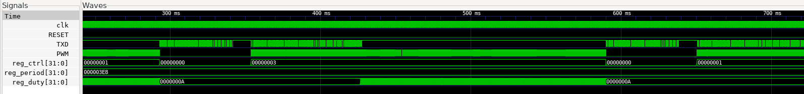
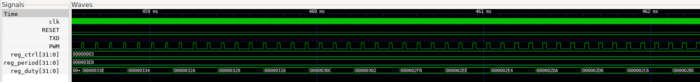

# VSDSquadron FPGA Mini Internship - Task 4 Submission

>**Objective:** Build a real SoC peripheral IP that generates a PWM output signal suitable for LED dimming or servo control.

## IP Specification
**Name:** PWM IP

**Functionality:**
- Four 32-bit registers
- *PWM_CTRL*    : `Bit 0` represents enable line (1 → enable PWM), `Bit 1` indicates polarity (0 → Active HIGH, 1 → Active LOW), Other bits are reserved.
- *PWM_PERIOD*  : Period count in ticks. Must be >= 1 .
- *PWM_DUTY*    : Duty count in ticks. Output is active for `PWM_DUTY` ticks, inactive for the rest of the period. (`PWM_DUTY = 0` → always inactive, `PWM_DUTY = 1` → always active)
- *PWM_STATUS*  : `Bit 0` → Enable line, `Bits [31:16]` → Current Counter value

**Interface:**
- Memory-mapped, connected to the existing CPU bus
- Uses the bus signals already present in the SoC

**Address Map:**
- Base Address  : `0x400000`
- PWM_CTRL      : `0x20`
- PWM_PERIOD    : `0x24`
- PWM_DUTY      : `0x28`
- PWM_STATUS    : `0x2C`
___
## Writing the PWM IP RTL

**Module Features:**
1. Register Write and Readback logic.
2. PWM output using counter.

**Path to `pwm_ip.v`:** `./basicRISCV/RTL/`

**RTL Code:**
```verilog
module pwm_ip (
    input             clk,
    input             resetn,
    // Bus Interface
    input             i_sel,      // Chip Select
    input             i_we,       // Write Enable
    input      [3:0]  i_addr,     // Address Offset (mem_addr[3:0])
    input      [31:0] i_wdata,    // Data from CPU
    output reg [31:0] o_rdata,    // Data to CPU
    // External Output
    output reg        pwm_out     // PWM signal to SoC
);

    // Register Map Offsets
    localparam CTRL   = 4'h0;
    localparam PERIOD = 4'h4;
    localparam DUTY   = 4'h8;
    localparam STATUS = 4'hC;

    // Registers
    reg [31:0] reg_ctrl;   // Bit 0: EN, Bit 1: POL
    reg [31:0] reg_period; // Period in ticks
    reg [31:0] reg_duty;   // Duty cycle in ticks
    
    // Internal Counter
    reg [31:0] counter;

    // Control Bit Aliases
    wire ctrl_en  = reg_ctrl[0];
    wire ctrl_pol = reg_ctrl[1];

    // --- Write Logic ---
    always @(posedge clk) begin
        if (!resetn) begin
            reg_ctrl   <= 32'b0;
            reg_period <= 32'd1; // Default minimum value
            reg_duty   <= 32'b0;
        end else if (i_sel && i_we) begin
            case (i_addr)
                CTRL:   reg_ctrl   <= i_wdata;
                PERIOD: reg_period <= i_wdata;
                DUTY:   reg_duty   <= i_wdata;
            endcase
        end
    end

    // --- Read Logic ---
    always @(*) begin
        if (i_sel && !i_we) begin
            case (i_addr)
                CTRL:   o_rdata = reg_ctrl;
                PERIOD: o_rdata = reg_period;
                DUTY:   o_rdata = reg_duty;
                STATUS: o_rdata = {counter, 15'b0, ctrl_en}; // Bit 0: RUNNING, Bits [31:16]: CURRENT COUNTER
                default: o_rdata = 32'b0;
            endcase
        end else begin
            o_rdata = 32'b0;
        end
    end

    // --- PWM Logic ---
    always @(posedge clk) begin
        if (!resetn) begin
            counter <= 32'b0;
            pwm_out <= 1'b0;
        end else if (ctrl_en) begin
            // Counter Management
            if (counter >= (reg_period - 1)) begin
                counter <= 32'b0;
            end else begin
                counter <= counter + 1;
            end

            // Output Generation
            // (Apply Polarity: if POL=1, invert the result)
            if (counter < reg_duty) begin
                pwm_out <= ctrl_pol ? 1'b0 : 1'b1;
            end else begin
                pwm_out <= ctrl_pol ? 1'b1 : 1'b0;
            end
        end else begin
            // When Disabled: Force inactive level
            counter <= 32'b0;
            pwm_out <= ctrl_pol ? 1'b1 : 1'b0; 
        end
    end

endmodule
```

___
## Integrating the IP into SoC

**Updates in `SOC` module of `riscv.v`:**
- Added the output port `PWM`.
- Added the select signal for PWM - 
	```verilog
	wire pwm_sel  = isIO & (mem_addr[7:4] == 4'h2)`.
	```
- Instantiated PWM IP.
- Updated Read Data MUX.

**Updates in `VSDSquadronFM.pcf`:**

Mapped the PWM port -
```pcf
set_io PWM 28
```
___
## Firmware Development

### Software Application `pwm_test.c`

**Path to `pwm_test.c`:** `./basicRISCV/Firmware/`

**Source Code:**
```c
#include "io.h"
#include "uart.h" // Custom UART Header File

// Delay function
void delay(int cycles) {
    for (volatile int i = 0; i < cycles; i++);
}

void main() {
    uprint("\n\t\t\t\t--- PWM IP Test ---\n");    

    // Configure PWM
    int polarity = 0;                          // Polarity = 0 (Active HIGH)
    const char *mode = (polarity == 1) ? "Active LOW" : "Active HIGH";
    IO_OUT(PWM_PERIOD, 1000);                  // Set Period to 1000 ticks
    IO_OUT(PWM_CTRL, polarity * 2 + 1);        // Enable = 1 
    uprint("\nConfiguring PWM: Period=%d, Mode=%s\n", 1000, mode);

    uint32_t status = IO_IN(PWM_STATUS);
    uprint("PWM Enabled. Current Status: 0x%x\n", status);

    // Breathe LED effect
    int duty = 0;
    int direction = 1;
    int count = 0;

    jump:
    while (count < 3) { // Breathe 3 times 
        // Update Duty Cycle
        IO_OUT(PWM_DUTY, duty);
        delay(10000); // Wait a bit so changes are visible

        if (direction) {
            duty += 10;
            if (duty >= 1000) direction = 0;
        } else {
            duty -= 10;
            if (duty <= 0) { direction = 1; count++; }
        }
    }
    
    // Disable PWM
    IO_OUT(PWM_CTRL, 0);
    status = IO_IN(PWM_STATUS);
    uprint("\nPWM Disabled. Current Status: 0x%x\n", status);
    delay(500000); // Wait for few seconds to observe disability

    // Invert the polarity
    count = 0;
    polarity = (polarity + 1) % 2;
    mode = (polarity == 1) ? "Active LOW" : "Active HIGH";
    IO_OUT(PWM_CTRL, polarity * 2 + 1);
    status = IO_IN(PWM_STATUS);
    uprint("\nPolarity Inverted. Current Status: 0x%x. Mode=%s\n", status, mode);

    goto jump;    // Repeat the same process  
}
```

### Header files
1. **`io.h`**

	*Updates:* Defined the address offsets of PWM registers -
	```h
	#define PWM_CTRL     0x20
	#define PWM_PERIOD   0x24
	#define PWM_DUTY     0x28
	#define PWM_STATUS   0x2C
	```

	*Path to `io.h`:* `./basicRISCV/Firmware/`
2. **`uart.h`**

	Header file defining the `uprint()` function that prints UART DATA to console.

	*Path to `uart.h`:* `./basicRISCV/Firmware/`
___
## Performing Simulation

1. Reduce the delays (e.g., `delay(10000);`) in software application `pwm_test.c` to speed up the simulation.
2. Convert it to a `.hex` file.
	```bash
	cd ./basicRISCV/Firmware
 	make pwm_test.bram.hex
 	```
3. Simulate the SoC.
   	```bash
    cd ../RTL
    iverilog -D BENCH -o pwm_test tb.v riscv.v pwm_ip.v gpio_control_ip.v sim_cells.v
    vvp pwm_test
    ```

	
	This image confirms that messages are transmitted perfectly through UART.

4. Observe the waveform.
   	```bash
    gtkwave pwm_test.vcd
    ```

	
	This waveform confirms that the IP is working according to the software program `pwm_test.c`.

	
	This zoomed waveform provides a close observation of `PWM` signal, demonstrating the successful working of IP.
___
## Performing Hardware Validation

**Steps:**
1. Add original delay values in software application `pwm_test.c` and rewrite the `pwm_test.bram.hex` file. This delay provides visibility of change in real-time.
2. Update the first line in `build` section of `Makefile` in `RTL` directory as follows -
	```bash
 	yosys  -q -p "synth_ice40 -top $(TOP) -json $(TOP).json" $(VERILOG_FILE) gpio_control_ip.v pwm_ip.v
 	```
3. Perform the Synthesis & Flash through `Yosys (Synth) → Nextpnr (Place & Route) → Icepack (Bitstream)`.
   	```bash
    make build
    make flash
    ```
4. Make the physical connections and observe the output.
5. Observe the output received through UART on console.
   	```bash
    make terminal
    ```

	
___
## How the IP works

### 1. Bus Interface (CPU to Hardware Communication)
The IP acts as a **memory-mapped device** on the SoC bus. It constantly monitors the bus signals to detect when the CPU wants to communicate with it.
- **Write Logic:** When the chip select (`i_sel`) and write enable (`i_we`) signals are high, the hardware acts as a multiplexer, routing the data from the CPU (`i_wdata`) into one of the three internal 32-bit configuration registers based on the address `i_addr`.
- **Read Logic:** When `i_sel` is high but `i_we` is low, the hardware routes the contents of its internal registers onto the read data bus (`o_rdata`) back to the CPU.

### 2. Internal Registers (State Storage)
The IP maintains its state using registers:
- **`reg_ctrl`**: Stores control bits. Hardware wires **Bit 0** to the internal `ctrl_en` (enable) signal and **Bit 1** to `ctrl_pol` (polarity).
- **`reg_period`**: Stores the 32-bit value defining the total duration (in clock ticks) of one PWM cycle.
- **`reg_duty`**: Stores the 32-bit value defining how many ticks the signal should remain "active".

### 3. The Timing Core (Counter & Comparators)
The core of the IP is a **32-bit synchronous up-counter** and two digital comparators:
- **Frequency Generation:** On every rising edge of the system clock (`clk`), the hardware compares the current `counter` value to `reg_period - 1`. If the counter has reached the period limit, the hardware resets the counter to 0. Otherwise, it increments the counter by 1.
- **Pulse Width Generation:** A second comparator continuously checks if the current `counter` is strictly less than the `reg_duty` value. This comparison generates a raw "active" or "inactive" logic level.

### 4. Output Logic (Polarity & Driver)
The final stage processes the raw signal before driving it out to the SoC:
- **Polarity Control:** The IP uses the `ctrl_pol` bit to decide whether to invert the signal. If `ctrl_pol` is 1 (Active LOW), the logic inverts the output. If `ctrl_pol` is 0 (Active HIGH), the signal is passed through as-is.
- **Registered Output:** The final calculated bit is stored in the `pwm_out` flip-flop on the clock edge, ensuring a clean signal driving the external pin.

